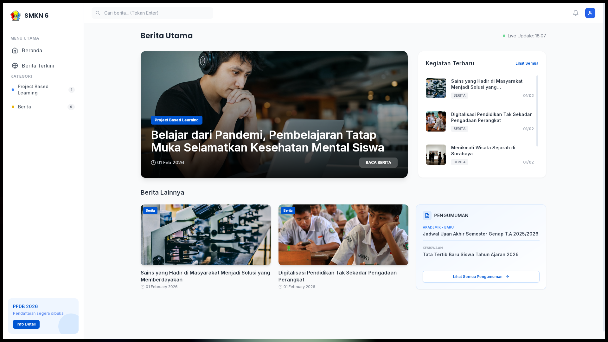

# 📰 News SMKN 6 Malang - Desktop Application

Aplikasi berita desktop modern untuk **SMKN 6 Malang** yang dibangun menggunakan teknologi **Photino.Blazor**. Aplikasi ini dirancang untuk memberikan akses cepat dan efisien terhadap informasi sekolah, pengumuman, dan berita terkini langsung dari desktop pengguna.



---

## ✨ Fitur Utama

- 🚀 **Real-time News:** Menampilkan daftar berita terbaru secara dinamis yang diambil langsung dari **Payload CMS**.
- 🔐 **Integrated Admin Panel:** Kelola berita (CRUD) secara instan melalui Admin Panel asli Payload CMS yang tertanam dalam aplikasi (_Iframe Modal_).
- 🔍 **Pencarian Cerdas:** Temukan berita dengan cepat melalui kolom pencarian di header.
- 🏷️ **Kategori Dinamis:** Menu samping yang menampilkan kategori berita secara otomatis beserta jumlah artikel di setiap kategorinya.
- 🔔 **Sistem Notifikasi:** Indikator lonceng cerdas yang memberitahu pengguna jika ada berita baru yang dirilis dalam 3 hari terakhir.
- 📱 **UI/UX Modern:** Desain antarmuka yang bersih dan responsif menggunakan **Tailwind CSS**.
- 🔗 **Integrasi PPDB:** Akses cepat ke halaman pendaftaran siswa baru (PPDB).

---

## 🛠️ Tech Stack

- **Frontend:** [Blazor WebAssembly](https://dotnet.microsoft.com/en-us/apps/aspnet/web-apps/blazor) (C# / .NET)
- **Desktop Wrapper:** [Photino](https://www.tryphotino.io/) (Lightweight alternative to Electron)
- **Styling:** [Tailwind CSS](https://tailwindcss.com/)
- **Backend / CMS:** [Payload CMS](https://payloadcms.com/)
- **API:** REST API dengan integrasi JSON cerdas.

---

## 🚀 Cara Menjalankan (Development)

Pastikan Anda sudah menginstal [.NET SDK 6+](https://dotnet.microsoft.com/download) di komputer Anda.

1.  Clone repositori ini:

    ```bash
    git clone https://github.com/mel-cell/NewsSMKN6Malang.git
    cd NewsSMKN6Malang
    ```

2.  Jalankan aplikasi dengan fitur **Hot Reload**:
    ```bash
    dotnet watch run
    ```

---

## ⚙️ Konfigurasi API

Pengaturan URL API Payload CMS dapat dikelola melalui file `appsettings.json`:

```json
{
  "ApiSettings": {
    "BaseUrl": "https://test.smkn6malang.sch.id"
  }
}
```

---

## 👨‍💻 Kontributor

- **Mell-cell** (Project Owner)
- **Antigravity AI** (Assistant Developer)

---

&copy; 2026 **SMK Negeri 6 Malang**. Semua hak dilindungi undang-undang.
